```{r, include = FALSE}
knitr::opts_chunk$set(
  collapse = TRUE,
  comment = "#>",
  eval = FALSE
)
```
<style>
  body {
    text-align: justify;
  }

  .col2 {
    columns: 2 200px;         /* number of columns and width in pixels */
    -webkit-columns: 2 200px; /* chrome, safari */
    -moz-columns: 2 200px;    /* firefox */
  }

  .leg {
    font-size: 12px;
  }

  img {
    display: block;
    margin-left: auto;
    margin-right: auto;
    max-width: 100%;
    height: auto;
  }

  .figure {
    text-align: center;
    margin: 20px 0;
  }

  .figure img {
    display: inline-block;
    vertical-align: middle;
  }

  .figure figcaption {
    font-size: 12px;
    text-align: center;
  }
</style>
* [Introduction](#introduction)
  + [Getting started](#getting-started)
  + [Why these calculations matter](#why-these-calculations-matter)
  + [How terravars fits into a wider workflow](#how-terravars-fits-into-a-wider-workflow)
* [Solar radiation](#solar-radiation)
  + [The solar index: direct beam radiation on sloped terrain](#the-solar-index-direct-beam-radiation-on-sloped-terrain)
  + [Terrain shading and the horizon](#terrain-shading-and-the-horizon)
  + [Sky-view factor and diffuse radiation](#sky-view-factor-and-diffuse-radiation)
  + [Two-stream canopy radiation](#two-stream-canopy-radiation)
  + [Canopy radiation in three dimensions](#canopy-radiation-in-three-dimensions)
* [Wind and coastal exposure](#wind-and-coastal-exposure)
  + [Topographic wind shelter](#topographic-wind-shelter)
  + [Orographic speed-up](#orographic-speed-up)
  + [Coastal exposure](#coastal-exposure)
* [Hydrology](#hydrology)
  + [Preparing a DTM for hydrological analysis](#preparing-a-dtm-for-hydrological-analysis)
  + [Flow accumulation](#flow-accumulation)
  + [Delineating and merging basins](#delineating-and-merging-basins)
  + [Topographic wetness index](#topographic-wetness-index)
* [Data download](#data-download)
  + [Downloading land cover](#downloading-land-cover)
  + [Downloading a DTM](#downloading-a-dtm)
* [Building a predictor stack](#building-a-predictor-stack)
* [References](#references)

## Introduction

How much solar radiation a slope receives, how much of the sky a location can see, how sheltered a valley is from the prevailing wind, how wet a hollow tends to remain, and how much light penetrates a forest canopy are all standard, long-established quantities in terrain and radiation analysis. Methods to calculate them - terrain shading and horizon geometry, sky-view factor, topographic wetness indices, wind-exposure metrics, and canopy radiative-transfer models such as the two-stream approximation - are used routinely in GIS software, including ArcGIS, SAGA GIS, GRASS GIS and WhiteboxTools. They are also widely used in remote sensing, hydrology, forestry, agriculture and solar-energy assessment. Efficient implementations of these calculations are readily available outside R. Within R, however, they remain surprisingly scarce. Functionality is scattered across one-off scripts, reimplemented as slow pure-R code that does not scale to landscape-sized datasets, or simply absent altogether. Fast implementations that work natively with `terra` are particularly lacking.

`terravars` brings this set of terrain- and canopy-derived calculations together in one place, implemented in C++ via `Rcpp` for speed and built around `terra` throughout.

The importance of these quantities is perhaps most apparent in understanding fine-scale climate variation. Weather observations from a station, or climate data from a reanalysis or model grid cell, describe conditions at a point or averaged over many square kilometres. Yet the environment experienced by a plant, an animal, a patch of soil, or a snow layer only a few metres away may differ substantially, largely because of terrain and vegetation. Variables such as solar radiation, sky-view factor, wind shelter and canopy light transmission help explain these local differences. Their importance for understanding microclimate is a recurring theme throughout this tutorial and was a major motivation for developing the package. However, the calculations themselves are entirely general-purpose and are equally useful in hydrology, forestry, habitat and species distribution modelling, agriculture, and solar-energy assessment.

### Getting started

`terravars` is built around the `terra` package for raster data handling, so `terra` objects (`SpatRaster`) are the expected input and output format throughout this tutorial. Install and load both packages, along with `terravars`' own bundled example data:

```{r, message = FALSE}
library(terra)
library(terravars)
```

The package ships with a small set of example rasters covering the Lizard peninsula, Cornwall, UK, all on the same 100 m grid, which are used in the examples throughout this tutorial and in every function's own help page:

```{r}
dtm <- rast(dtm100m)   # digital terrain model (elevation, m)
pai <- rast(pai)        # plant area index (m2 m-2)
hgt <- rast(hgt)        # canopy height above local ground (m)
vgx <- rast(vegx)       # leaf angle distribution parameter
```

`dtm100m`, `pai`, `hgt` and `vegx` are stored internally as wrapped `SpatRaster` objects (`terra`'s `PackedSpatRaster`, needed so they can be saved as package data), so each needs to be passed through `rast()` before use, as above. `dtm100m` is required by every function in the package; `pai`, `hgt` and `vegx` are only needed once vegetation is introduced, from the [Two-stream canopy radiation] section onwards.

Every function in `terravars` is documented on its own help page (`?solarindex`, `?skyview`, and so on), each with a runnable example. The computationally-intensive parts of the package are implemented in C++ via `Rcpp`; if you want to see exactly how a value is calculated, the R-level function bodies can be inspected by typing the function name at the console (e.g. `solarindex`), and the underlying C++ source is browsable in the package's `src/` folder or on [GitHub](https://github.com/ilyamaclean/terravars).

### Why these calculations matter

Terrain and vegetation reshape local conditions in three largely independent ways:

- **Radiation.** How much direct and diffuse sunlight a point receives depends on the slope and aspect of the ground beneath it, whether the surrounding terrain blocks part of the sky (terrain shading, and the sky-view factor for diffuse light), and how much of that light is intercepted by vegetation before it reaches the ground.
- **Wind.** How exposed a point is to the wind depends on whether the terrain upwind rises above it (sheltering) or falls away (exposure).
- **Moisture.** How wet or dry a point tends to be, independent of rainfall itself, depends on its position in the landscape: water draining from higher, larger contributing areas accumulates preferentially in valleys and hollows.

Each of these effects can be substantial over distances of a few metres to a few hundred metres - well below the resolution of a weather station network, a climate model grid, a standard land-cover map, or many hydrological and ecological datasets - which is exactly why a high-resolution terrain and canopy layer is needed to derive them properly, whatever the downstream application.

### How terravars fits into a wider workflow

`terravars` does not sit inside any one downstream field - it produces the terrain- and canopy-derived layers that a wide range of workflows need as an input. A typical use starts the same way regardless of the application: obtain a DTM (and, where relevant, vegetation structure data) for the area of interest, then use `terravars` to turn it into a stack of solar, wind and moisture predictor layers. From there, those layers might feed directly into a GIS analysis or map; into a statistical model relating them to some observed outcome (species occurrence, crop yield, site suitability); into a hydrological model; or, in the specific case of microclimate, into a full mechanistic energy-balance model. Packages such as `micropoint`, `microclimf` and `mesoclim` are examples of the latter - R packages that model temperature, humidity, wind and radiation together as a coupled energy balance, using exactly the kind of terrain and canopy inputs `terravars` produces. `terravars` is not itself one of these models: it does not calculate longwave radiation, sensible or latent heat exchange, or soil and snow thermal dynamics. Its scope stops at the point where terrain and vegetation structure have been turned into the spatial predictors that everything downstream - mechanistic model, statistical model, or a plain GIS layer - actually needs.

The rest of this tutorial works through each function in turn, grouped by the effect it quantifies - solar radiation, wind, then moisture - before finishing with an example of combining several of them into a single predictor stack for a landscape.

## Solar radiation

`solarindex()` covers surface geometry, terrain shading, and two ways of accounting for canopy cover. `horizon()` and `skyview()` develop its terrain-shading and sky-visibility pieces further in their own right; `twostream()` and `canopy3d()` turn its vegetation-attenuation piece into standalone canopy radiation models.

### The solar index: direct beam radiation on sloped terrain

#### What it measures

`solarindex()` calculates the fraction of direct-beam solar irradiance intercepted by a surface with a given slope and aspect. In simple terms, it describes how directly the surface faces the sun at a particular time: values approach 1 when sunlight strikes the surface at right angles and fall towards 0 as the beam becomes increasingly oblique. Surfaces facing away from the sun receive a value of 0.

Technically, the index is the cosine of the solar incidence angle - the angle between the incoming solar beam and the normal to the surface - bounded between 0 and 1. Multiplying direct normal irradiance by this index gives the direct-beam irradiance incident on the sloping surface. When topographic shading is included, locations hidden from the sun by surrounding terrain are also assigned a value of 0.

Slope and aspect are worked out from `dtm` automatically, so the minimum call needs only a DTM and a time:

```{r}
tme <- as.POSIXct("2023-06-21 12:00", tz = "UTC")
si  <- solarindex(dtm, tme)
plot(si, main = "Solar index, summer solstice, solar noon")
```
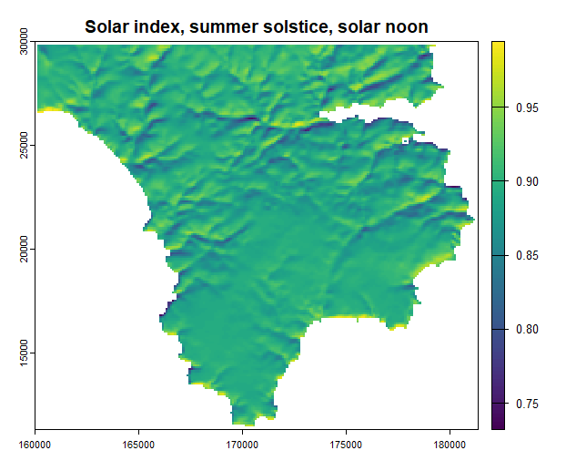


Everything else `solarindex()` does - averaging over many sun positions, terrain shading, canopy attenuation - builds on this single calculation, repeated for as many sun positions as needed and then combined.

#### DTMs with missing data: fillna

Before going any further, it's worth understanding something that's already silently true of `si_noon` above and of every other example in this section: the Lizard Peninsula DTM used throughout this tutorial is a real coastal DTM, with `NA` values over the sea. That has consequences beyond just those `NA` cells themselves. Slope and aspect are calculated from a small neighbourhood around each cell, so a perfectly good land cell next to the sea also comes out `NA` simply because its neighbourhood includes one. The same issue occurs around the outer edge of any DTM, where the outermost ring of cells lacks neighbours beyond the raster boundary. Left alone, this produces a halo of `NA` values along coastlines and around the edge of the DTM itself.

Setting `fillna = TRUE` avoids both problems by temporarily filling only those missing or unavailable neighbouring cells using the elevation of their nearest valid neighbour before slope and aspect are calculated. Coastal cells therefore borrow elevations from the nearest land, while cells at the edge of the DTM borrow from their nearest interior neighbour. Once the calculation is complete, the original `NA` mask is restored, so the sea remains `NA` in the final output while only the spurious `NA` values over land are removed.

```{r}
si_fix <- solarindex(dtm, tme, fillna = TRUE)
plot(c(si, si_fix), main = c("Default", "fillna = TRUE"), mar = c(2, 2, 2, 5))
```
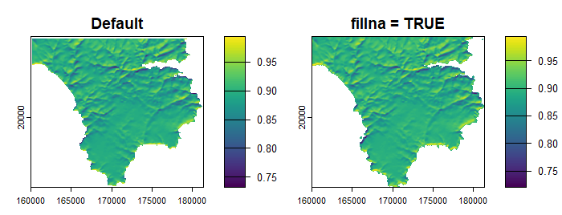

`fillna = TRUE` works around this by temporarily treating `NA` cells as elevation 0 for the calculation, then masking the result back to the DTM's real `NA` pattern afterwards - so the sea itself is still `NA` in the output, but the coastline right next to it no longer is. Every `solarindex()` example for the rest of this section inherits the same halo, since `fillna` is left off from here on purely to keep each one focused on whatever argument it's actually demonstrating - not because the halo stops applying. `twostream()` and `twi()` accept the same argument for the same reason, since they derive slope from `dtm` internally in exactly the same way.

#### Averaging over many sun positions: wgt

Most uses need more than one instant. Pass `tme` a vector of date-times instead of a single value, and `solarindex()` works out the index separately for each one and combines them according to `wgt`:

```{r}
tme <- seq(as.POSIXct("2023-06-21 05:00", tz = "UTC"),
           as.POSIXct("2023-06-21 20:00", tz = "UTC"),
           by = "1 hour")
si_mean  <- solarindex(dtm, tme)                     # wgt = "mean" (default)
si_clear <- solarindex(dtm, tme, wgt = "clearsky")   # weighted toward clear-sky-bright steps
si_all   <- solarindex(dtm, tme, wgt = "all")        # one layer per timestep, no averaging
plot(c(si_mean, si_clear), main = c("Mean", "Clear-sky"), mar = c(2, 2, 2, 5))
```
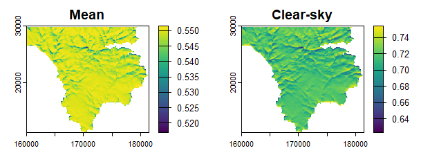

`wgt = "mean"` (the default) is a simple average across the timesteps supplied, counting any night-time ones as zero - so a purely daytime sequence like the one above gives a daytime average, while a full 24-hour sequence would give a lower day-and-night average. `wgt = "clearsky"` instead leans on the timesteps with the strongest clear-sky sunlight, which is often a better match for how much solar energy a point actually receives over typical weather than a plain average across the hours supplied. `wgt = "all"` skips averaging entirely and returns a multi-layer `SpatRaster`, one layer per timestep, named by timestamp:

```{r}
si_all
plot(si_all[[c(1, 8, 12, 16)]])
```
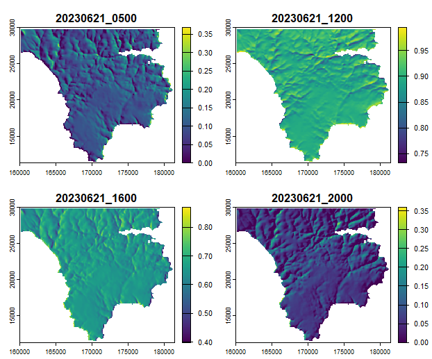

#### A typical year in one call: annual mode

Passing `tme = "annual"` instead of a vector gives a representative year-round estimate without having to build a timestep vector yourself. Internally, sun positions are sampled across the whole of 2023 and collapsed into a manageable number of representative positions (binned by 5 degrees of zenith and azimuth, capped at 40 bins), so the result is accurate without the cost of evaluating all 8760 hours one by one:

```{r}
si_annual <- solarindex(dtm, "annual", wgt = "clearsky")
plot(si_annual, main = "Annual solar index (clear-sky weighted)")
```
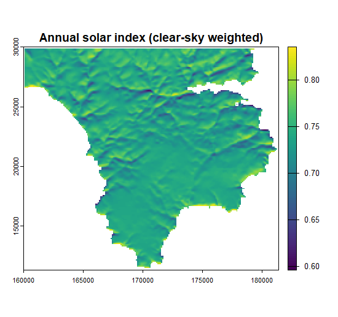

`wgt` still works the same way as above - `"clearsky"` weights sunnier representative positions more heavily, `"mean"` weights every daylight position equally - so it's worth setting explicitly for annual runs rather than relying on the ordinary default. `wgt = "all"` isn't available in annual mode, since that would mean up to 8760 separate layers.

#### Accounting for surrounding terrain: shade

Everything so far only considers a point's own slope and aspect - it ignores whether a nearby hill or ridge is actually blocking the sun at a given moment. Setting `shade = TRUE` adds that check: points currently hidden behind the horizon are set to zero, on top of the ordinary slope/aspect effect.

```{r}
tme_dawn <- as.POSIXct("2023-06-21 05:00", tz = "UTC")
si_shade   <- solarindex(dtm, tme_dawn, shade = TRUE)
si_noshade <- solarindex(dtm, tme_dawn, shade = FALSE)
plot(c(si_shade, si_noshade), main = c("Terrain shaded", "No shading"), mar = c(2, 2, 2, 5))
```
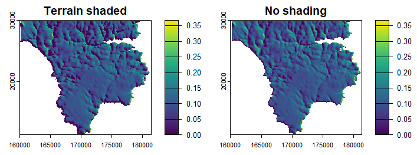

With shading switched on, it's the west-facing coastal cliffs that show the effect most clearly, with much of their sunward side dropping to zero at this early hour, when the sun still sits low in the east. Working this out means comparing the sun's elevation against the height of the horizon in its direction at each point, and setting the solar index to zero wherever the sun sits below that horizon, on top of the ordinary slope/aspect effect. How carefully that horizon is searched is controlled by `nstep`: the default (`0`) checks every cell out to the edge of the map for maximum accuracy, while a positive value trades a little accuracy for speed by sampling more sparsely further away. `solarindex()` also only searches as many compass directions as the sun positions being evaluated actually require, rather than always scanning a full fixed set regardless of how few timesteps are involved, so a single moment like the one above needs just one direction rather than a full sweep - see [Terrain shading and the horizon] for more on both settings.

#### One shared sun position or many: cenloc

By default (`cenloc = TRUE`), `solarindex()` works out the sun's position once, at the centre of the map, and reuses it for every cell - fast, and accurate enough as long as the map isn't so large that the sun's true position varies noticeably from one side to the other. Setting `cenloc = FALSE` instead computes a genuinely separate sun position for every cell, which matters more for maps spanning a large fraction of a degree of latitude or longitude (a warning appears automatically if `cenloc = TRUE` is used on a map that large). The Lizard peninsula example data used throughout this tutorial is small enough that the difference is negligible either way:

```{r}
tme <- as.POSIXct("2023-06-21 12:00", tz = "UTC")
si_percell <- solarindex(dtm, tme, cenloc = FALSE)
si_centre <- solarindex(dtm, tme, cenloc = TRUE) # default
max(abs(values(si_centre) - values(si_percell)), na.rm = TRUE)
```

For a DTM covering a whole country or continent, that difference would be far from negligible, and `cenloc = FALSE` becomes the right choice despite the extra computation - though note it can't be combined with the diagonal canopy ray-marching described next, which always needs one shared sun position per timestep.

#### Attenuation by a plant canopy: pai and x

Supplying a plant area index raster via `pai` - a measure of how much leaf, stem and branch material sits above each point - reduces the solar index to account for some of that light being blocked by the canopy, in much the same way light dims passing through a hedge:

```{r}
si_veg <- solarindex(dtm, tme, pai = pai, x = vgx)
plot(si_veg, main = "Solar index attenuated by canopy (pai, straight-down)")
```
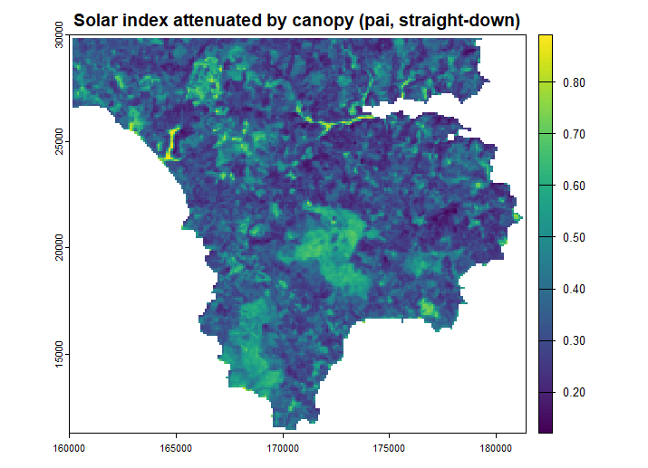

By default, this assumes sunlight travels straight down through whatever canopy sits directly above each point, rather than tracing its actual diagonal path through neighbouring cells' canopy. That holds up well when the sun is high in the sky, so the real path barely strays sideways, or when the DTM's grid resolution is coarse enough that any sideways drift stays within the same cell anyway. It matters more as canopy cover gets more heterogeneous - real canopy cover is never uniform, but the patchier it is, the more a neighbouring cell's canopy can differ from what's actually sitting above the sun's true path. The `x` argument controls how the canopy's leaves are typically angled, which affects how much light passing through gets blocked versus slipping through gaps: leave it at the default (`1`) for a typical mixed canopy, use a value near `0` for canopies of mostly upright, vertical leaves (some conifers, many grasses), or a large value (or `Inf`) for canopies of mostly flat, horizontal leaves (many broadleaf trees). A single scalar is fine when one canopy type dominates the whole area; where cover is a mix of vegetation types with genuinely different leaf orientations - grassland, conifer plantation, broadleaf woodland - a raster captures that variation instead, which is why `x` is supplied here as the bundled `vegx` raster, derived from land-cover classification across the Lizard peninsula. This attenuation uses the same underlying calculation as [Two-stream canopy radiation], so the two functions give closely matching results for equivalent inputs.

`pai` is assumed to be measured per unit horizontal ground area by default - the usual way leaf/plant area index is reported - and is converted internally to account for the ground's actual slope. If your `pai` was instead measured per unit sloped ground-surface area, set `pai_horiz = FALSE`. The two conventions agree on flat ground and only diverge where the terrain tilts.

#### A more realistic canopy: hgt

The straight-down approximation above breaks down where canopy cover is patchy - a gap or a shorter neighbouring patch of vegetation should let more light in at an angle than a purely vertical calculation would suggest, and a taller, denser neighbour should block more. Supplying canopy height via `hgt` switches on a more realistic calculation that traces the sun's actual path sideways across neighbouring points' canopies, not just straight down through each point's own:

```{r}
tme <- as.POSIXct("2023-06-21 07:00", tz = "UTC")
si_veg2d <- solarindex(dtm, tme, pai = pai, x = vgx)
si_veg3d <- solarindex(dtm, tme, pai = pai, x = vgx, hgt = hgt)
dif <- si_veg2d - si_veg3d
plot(c(si_veg2d, si_veg3d, dif), main = c("2D", "3D", "Difference"), mar = c(2, 2, 2, 5))

```
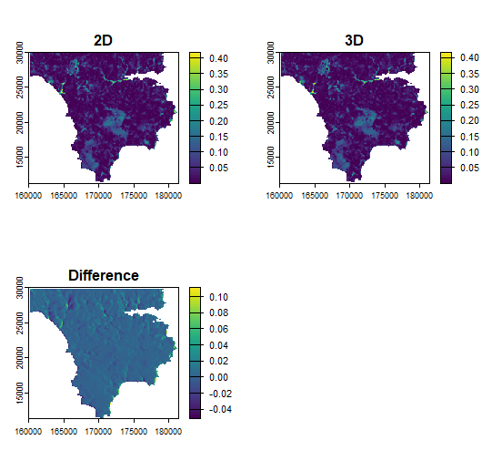

This is noticeably slower than the straight-down version, since the result can't be pre-computed once and reused across sun positions the way terrain shading can - it currently requires `cenloc = TRUE`, and prints a warning if requested for more than 100 sun positions at once. It's the same ray-marching mechanism used by [Canopy radiation in three dimensions], applied here as one extra layer on top of the ordinary terrain-based solar index rather than as a standalone canopy model.

#### Canopy or ground: the ground argument

By default (`ground = TRUE`), the result with `pai` supplied describes sunlight that has passed *through* the canopy and reached the ground beneath it. Setting `ground = FALSE` instead describes the sunlight caught by the canopy and ground *together*, treated as one combined surface:

```{r}
tme <- as.POSIXct("2023-06-21 12:00", tz = "UTC")
si_ground <- solarindex(dtm, tme, pai = pai, x = vgx, ground = TRUE)
si_canopy <- solarindex(dtm, tme, pai = pai, x = vgx, ground = FALSE)
plot(c(si_ground, si_canopy), main = c("Ground", "Ground and canopy"), mar = c(2, 2, 2, 5))
```
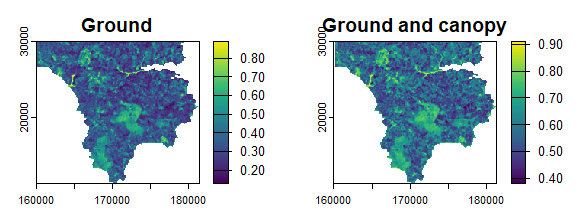

This matters when it's the vegetation surface itself you're interested in rather than the soil underneath it - a grass sward is the clearest case, where there's no meaningful separate "ground beneath the canopy" to speak of, and canopy and ground are more naturally treated as a single intercepting surface.

#### Supplying your own slope and aspect

`slp` and `asp` are worked out from `dtm` automatically whenever they're left as `NULL`, which is the normal case. Supplying them explicitly is mainly useful when calling `solarindex()` many times over the same DTM and wanting to avoid recomputing identical slope/aspect rasters each time, or when a different slope/aspect surface is deliberately wanted - a smoothed DTM, for instance:

```{r}
slp <- terrain(dtm, "slope",  unit = "degrees")
asp <- terrain(dtm, "aspect", unit = "degrees")
si_custom <- solarindex(dtm, tme, slp = slp, asp = asp)
```

With `dtm`'s own slope and aspect supplied back in unchanged, this reproduces `si_mean` from earlier exactly.

### Two-stream canopy radiation

`solarindex()` calculates the fraction of the sun's direct beam that reaches the ground without being intercepted by vegetation. This is only part of the radiation budget beneath a canopy. Some radiation intercepted by leaves is reflected or transmitted and may subsequently reach the ground as diffuse radiation. Ignoring this scattered component will therefore underestimate the total energy reaching the surface, with consequences for applications such as modelling surface and leaf temperatures, evapotranspiration, snowmelt, and plant growth.

`twostream()` provides a more complete description of shortwave radiation beneath a canopy. It returns three fractions: direct radiation that passes through the canopy without interception (`fdirdown`), diffuse sky radiation that reaches the ground (`fdifdown`), and direct radiation that is intercepted by the canopy but subsequently scattered downwards (`fdirscat`).

The amount of vegetation is specified using plant area index (`pai`). The optional leaf-angle parameter (`x`) describes the dominant orientation of the foliage and may be supplied as either a single value or a raster. Values close to 0 represent predominantly upright leaves, whereas large values represent predominantly horizontal leaves. If `x` is omitted, a value of 1 is used, representing an intermediate leaf-angle distribution.

Leaf reflectance (`lref`) and transmittance (`ltra`) specify the fractions of radiation striking a leaf that are reflected or pass through it. The remaining fraction is absorbed by the foliage, so `lref + ltra` must be less than 1. If these inputs are omitted, reflectance and transmittance are set to 0.4 and 0.2, respectively. These defaults are intended for broadband solar radiation; different values can be supplied when modelling a particular part of the spectrum, such as photosynthetically active radiation. Ground reflectance (`gref`) specifies the fraction of radiation reaching the ground that is reflected back into the canopy and defaults to 0.15. Together, these properties determine how much radiation is repeatedly scattered between the foliage and ground before it is absorbed, reaches the surface, or escapes from the canopy.

A digital terrain model (`dtm`) is also required because slope and aspect affect the angle at which the direct solar beam passes through the canopy. One or more UTC times are supplied through `tme`. The position of the sun is calculated separately for every raster cell using its geographic coordinates, rather than assuming a single solar position across the whole map.

```{r}
tme <- as.POSIXct("2023-06-21 12:00", tz = "UTC")
ts <- twostream(dtm, pai, tme, x = vgx)
plot(ts, main = c("fdirdown", "fdifdown", "fdirscat"))
```
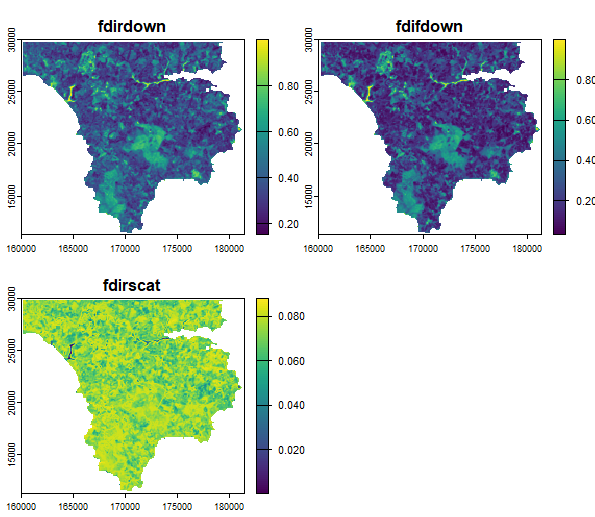

Each output layer contains a fraction between 0 and 1. The total shortwave radiation reaching the ground can therefore be calculated from the above-canopy direct (`swdir`) and diffuse (`swdif`) radiation as:

```{r}
swrad <- swdir * fdirdown + swdif * fdifdown + swdir * fdirscat
```

When several times are supplied, `twostream()` averages the fractions across them by default. Night-time values count as zero for `fdirdown` and `fdirscat`, so only daytime times should be supplied when a daytime mean is required. The diffuse fraction, `fdifdown`, does not depend on solar position and is therefore unchanged across timesteps. Setting `output = "stack"` instead returns separate raster layers for every time, allowing temporal variation to be retained.

```{r}
tme_day <- seq(as.POSIXct("2023-06-21 05:00", tz = "UTC"),
               as.POSIXct("2023-06-21 20:00", tz = "UTC"),
               by = "1 hour")

ts_day <- twostream(dtm, pai, tme_day, x = vgx)

ts_stack <- twostream(dtm, pai, tme_day, x = vgx,
                      output = "stack")
```

The `pai_horiz` argument specifies the area against which PAI is expressed. Its default, `pai_horiz = TRUE`, follows the usual convention of reporting plant area per unit horizontal ground area. Setting it to `FALSE` indicates that PAI is expressed per unit of the sloping land surface. The distinction has no effect on flat ground but matters on slopes, where the two area measures differ. `twostream()` converts between the conventions internally because the direct-beam and diffuse calculations require PAI on different area bases.

Finally, setting `fillna = TRUE` prevents cells from acquiring missing values where slope and aspect cannot otherwise be calculated because part of the local neighbourhood extends over an `NA` region or beyond the edge of the DTM. This is particularly useful for coastal rasters, where land cells beside an `NA` sea cell would otherwise acquire missing values, but it also avoids the ring of missing values that would otherwise appear around the outer edge of the output.

```{r}
ts_coast <- twostream(dtm, pai, tme, x = vgx, fillna = TRUE)
```

### Canopy radiation in three dimensions

The uniform-canopy assumption used by `twostream()` becomes less realistic where canopy structure varies strongly over space, such as around gaps, clearings, forest edges, isolated trees, or neighbouring stands of different heights. In these situations, the amount of radiation reaching a point depends not only on the total amount of vegetation, but also on where that vegetation lies relative to the sun and the visible sky.

`canopy3d()` accounts for this spatial structure by tracing the paths of direct and diffuse radiation through a three-dimensional canopy represented by plant area index (`pai`) and vegetation height (`hgt`). This allows gaps, edges, isolated trees, and changes in canopy height to affect radiation transmission according to their actual position around each point.

```{r}
c3 <- canopy3d(dtm, pai, hgt, tme, x = vgx)
plot(c3, main = c("fdirdown", "fdifdown"), mar = c(2, 2, 2, 5))
```
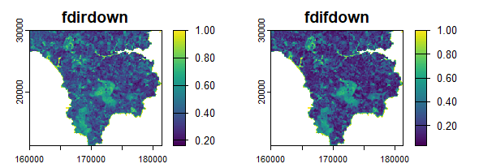

The three-dimensional calculation returns the fractions of direct and diffuse radiation reaching the ground, but not a separate scattered-direct component. Representing repeated scattering between leaves and the ground is not readily compatible with tracing individual paths through a spatially explicit canopy. `canopy3d()` is therefore most useful where local canopy geometry is important, whereas `twostream()` is faster and includes a more complete treatment of scattering where a horizontally uniform canopy is a reasonable approximation.

### Terrain shading and the horizon

`horizon()` calculates the horizon angle in each compass direction: the angle between horizontal and the highest terrain visible in that direction. Large horizon angles indicate that terrain such as ridges or valley sides blocks much of the sky, whereas angles close to 0 degrees indicate an unobstructed horizon. These horizon angles underpin several other functions in the package, including `solarindex()`, `skyview()`, and `wind_shelter()`, which use them to determine when terrain blocks direct sunlight, diffuse sky radiation, or wind.

The function takes a digital terrain model (`dtm`) together with one or more compass directions (`azi`) in which the horizon should be calculated. By default, it evaluates the eight cardinal and intercardinal directions (N, NE, E, etc.), but any set of azimuths can be supplied. The `nstep` argument controls how thoroughly the surrounding terrain is searched. The default (`nstep = 0`) checks every intervening point out to the edge of the raster, whereas positive values use a progressively sparser search that is substantially faster for large datasets but may miss terrain lying between the sampled distances. Here we use the defaults, so only `dtm` is supplied.

```{r}
ha <- horizon(dtm)
plot(ha)
```
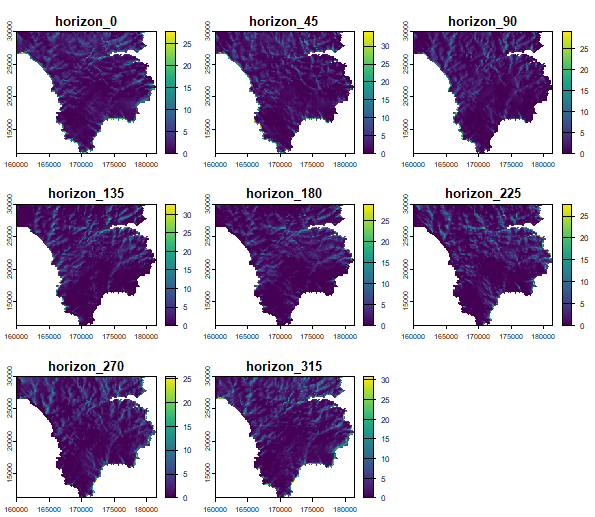

By default, the horizon is calculated as seen from ground level. The `obs_hgt` argument instead raises the observer above the surface before searching, which is useful for elevated instruments such as wind sensors or turbine hubs: a point a few metres up "sees over" more of the surrounding terrain than one standing right on the ground, so its horizon angle tends to be lower. This is exactly what `wind_shelter()` uses to evaluate shelter at a specified height above ground rather than at ground level. The example below compares the horizon looking west (`azi = 270`) at ground level and at 2 m.

```{r}
ha_ground <- horizon(dtm, azi = 270)
ha_2m     <- horizon(dtm, azi = 270, obs_hgt = 2)
plot(c(ha_ground, ha_2m), main = c("Ground level", "2 m above ground"), mar = c(2, 2, 2, 5))
```
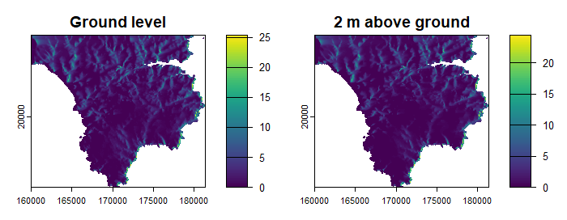

### Sky-view factor and diffuse radiation

`skyview()` computes the sky-view factor (SVF): the fraction of the sky hemisphere visible from any given location, ranging from 0 where the sky is completely obscured to 1 where the entire sky is visible. Sky-view factor controls how much diffuse radiation from the sky reaches the surface. Unlike direct sunlight, which arrives from the direction of the sun, diffuse radiation arrives from across the sky, so surrounding terrain or vegetation reduces it by obscuring part of the visible hemisphere.

The simplest calculation considers only terrain. In this case, variation in sky-view factor depends entirely on how much of the sky is blocked by surrounding hills, ridges, and valley sides.

```{r}
svf <- skyview(dtm)
plot(svf, main = "Sky-view factor (terrain only)")
```
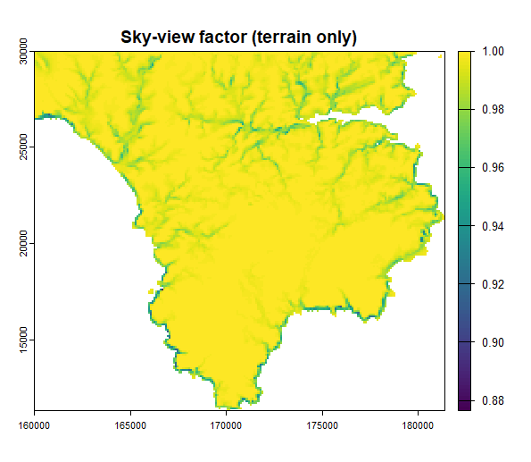

Supplying plant area index (`pai`) extends the calculation to include attenuation by vegetation as well as obstruction by terrain. By default, canopy transmission is calculated using the two-stream model described above. The leaf-angle parameter (`x`) and the leaf and ground optical properties can be supplied in the same way as for `twostream()`.

```{r}
svf_veg <- skyview(dtm, pai = pai, x = vgx)
```

The simpler Goudriaan calculation can instead be selected using `model = "goudriaan"`. As described above, this treats radiation as declining exponentially as it passes through the vegetation and does not represent repeated scattering between the canopy and ground.

```{r}
svf_goud <- skyview(dtm, pai = pai, model = "goudriaan")
plot(c(svf_veg,svf_goud), main = c("Two-stream", "Goudriaan"), mar = c(2, 2, 2, 5))
```
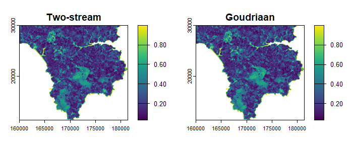

With either of these approaches, the canopy is treated as horizontally uniform. Supplying a raster of canopy height (`hgt`) together with `model = "goudriaan"` instead enables a three-dimensional calculation. The function evaluates terrain and canopy obstruction across multiple compass directions and bands of sky elevation, so a canopy gap in one direction or a taller stand in another contributes differently to the overall sky-view factor.

```{r}
svf_3d <- skyview(dtm, pai = pai, hgt = hgt, model = "goudriaan")
plot(svf_3d, main = "Sky-view factor, 3D canopy")
```
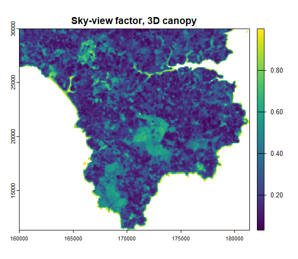

## Wind

Wind speed near the ground is influenced by topography in two main ways. First, wind speeds generally increase over elevated, exposed terrain because airflow accelerates over hills and ridges. Second, terrain can locally reduce wind speed by sheltering locations from winds arriving from particular directions, creating sheltered areas in the lee of hills and within valleys. `wind_shelter()` estimates this directional sheltering effect. Since `wind_altitude()` estimates the overall influence of topography on wind speed, it incorporates both the tendency for winds to increase over elevated terrain and the sheltering effects of surrounding terrain. Used together, the two functions explicitly account for directional shelter while retaining the broader topographic adjustment.

### Topographic wind shelter

`wind_shelter()` estimates the reduction in wind speed caused by higher ground lying upwind of a location. For one or more wind directions, it searches upwind for the highest blocking terrain and converts the resulting horizon angle into a shelter coefficient (Ryan, 1977): a wind-speed scaling coefficient between 0 and 1 that can be multiplied directly by an input wind speed. Values close to 1 indicate little shelter (for example, ridge tops or open ground), whereas values close to 0 indicate locations well sheltered by surrounding terrain, such as valley bottoms or the lee side of a ridge. Supplying multiple wind directions returns one layer for each direction, named according to its bearing (`wind_shelter_225`, `wind_shelter_270`). 

```{r}
ws <- wind_shelter(dtm, wdir = c(90, 270))
plot(ws, main = c("Shelter, wind from E", "Shelter, wind from W"), mar = c(2, 2, 2, 5))
```
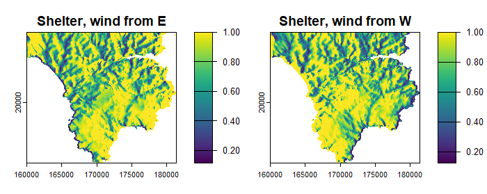

HOwever, wind speed is usually measured or modelled some distance above the ground (for example at 2 m, 10 m or turbine hub height). Shelter can instead be estimated at the corresponding observation height using the obs_hgt argument. As the observation height increases, more of the surrounding terrain becomes visible and the sheltering effect typically becomes weaker.

```{r}
ws_10m <- wind_shelter(dtm, wdir = 270, obs_hgt = 10)
plot(c(ws[["wind_shelter_270"]], ws_10m), main = c("Ground level", "10 m mast"), mar = c(2, 2, 2, 5))
```
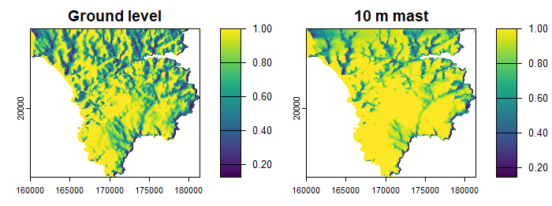

If horizon angles have already been calculated (for example in the [Terrain shading and the horizon] section), they can be supplied directly via `hor` to avoid recomputing them.

```{r}
ha  <- horizon(dtm, azi = c(225, 270))
ws2 <- wind_shelter(wdir = c(225, 270), hor = ha)
```

### Wind and elevation

Topographic shelter is only one component of local wind variation. Elevated terrain such as hilltops, ridges and headlands often experiences stronger winds because wind speed generally increases with elevation above sea level. `wind_altitude()` builds on the terrain shelter represented by `wind_shelter()` by also accounting for this elevational increase in wind speed. It returns a scaling coefficient greater than or equal to one: locations at or below a reference elevation receive a value of 1, while progressively higher terrain receives increasingly larger coefficients. The two functions are intended to be used together. The two functions are designed to be used together. Multiplying their coefficients gives a single coefficient that can be used to adjust wind speeds for terrain effects.

```{r}
ws <- wind_shelter(dtm, wdir = 270)
wa <- wind_altitude(dtm)
wcoef <- ws * wa
plot(c(wa, wcoef), main = c("Elevetation effect", "Overall terrain effect"), mar=c(2,2,2,5))
```
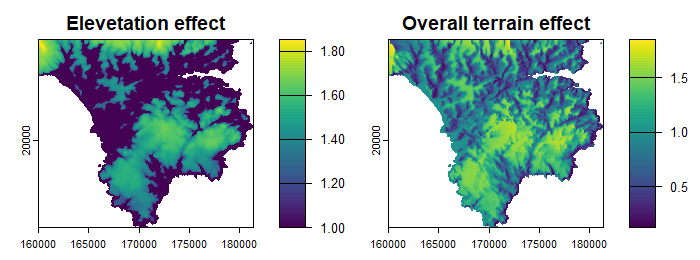

By default, the reference elevation is the mean elevation of the DTM. In practice, it is often preferable to use the elevation at which the source wind data are representative, such as the elevation of the weather station or model grid cell being downscaled.

```{r}
wa_station <- wind_altitude(dtm, ref_elev = 145)
```

Instead of a single reference elevation, a coarser-resolution DTM can be supplied via `coarse_dtm`. Each fine-scale cell is then compared with the elevation represented by the corresponding coarse cell, making the calculation more appropriate when downscaling gridded wind products.

```{r}
dtm_coarse <- aggregate(dtm, fact = 10, fun = "mean", na.rm = TRUE)
wa_coarse <- wind_altitude(dtm, coarse_dtm = dtm_coarse)
plot(wa_coarse, main = "Speed-up relative to a coarse reference grid")
```
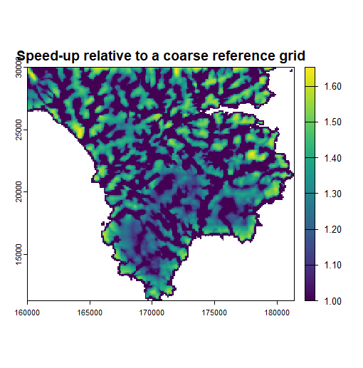

The `meas_hgt` argument specifies the height above ground to which the wind speed applies (2 m by default). Elevation differences have a larger influence on measurements made close to the surface than on those made further above it.

```{r}
wa_10m <- wind_altitude(dtm, meas_hgt = 10)
```

## Coastal exposure

Topography is not the only control on local climate. Near the coast, the sea moderates local temperatures, reducing temperature extremes and increasing humidity. The strength of this maritime influence depends on how much open water lies upwind of a location. `coastalexposure()` quantifies this by estimating the proportion of land and sea encountered along the upwind fetch. The resulting coastal exposure index provides a simple measure of maritime influence that can be used as a predictor of land–sea temperature gradients.

For a specified wind direction, the function samples along the upwind fetch, weighting nearby land and sea more strongly than distant areas. The resulting coastal exposure index ranges from 0 (an entirely terrestrial fetch, fully sheltered from the coast) to 1 (an entirely maritime fetch, fully exposed to open water).

The function requires a land/sea mask, represented by a raster with `NA` values over water and any other value over land. Although described here in terms of the sea, the same approach applies equally to lakes, reservoirs and other water bodies represented by `NA` values. Where a DTM already has this structure, as in the Lizard Peninsula example used throughout this vignette, a suitable mask can be created directly:

```{r}
landsea <- dtm
landsea[!is.na(landsea)] <- 1
ce_w <- coastalexposure(landsea, wdir = 270)
plot(ce_w, main = "Coastal exposure, westerly")
```

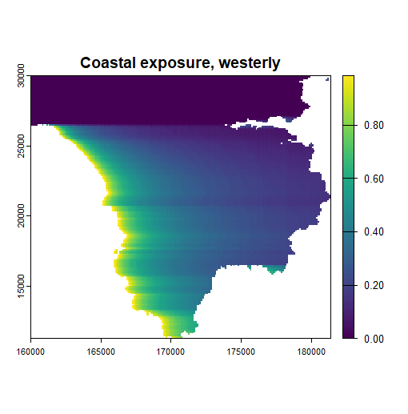

Values are calculated only within the extent of `landsea`. Samples falling outside the available fine- or coarse-resolution masks are ignored, so cells near the edge of the supplied data may be estimated from fewer samples points than cells further inside the raster. Supplying one or more coarser land/sea masks via `coarse` extends the search beyond the extent of `landsea`, reducing these edge effects without requiring a single very large fine-resolution raster. `coarse` may be either a single `SpatRaster` or a list of progressively coarser rasters. In the example below we use the package's built-in `dtmc` object, which is a list of two nested land/sea masks covering a much larger area than `landsea`.

```{r}
ce_far <- coastalexposure(landsea, wdir = 270, coarse = dtmc)
plot(ce_far, main = "Coastal exposure, westerly - wide area")
```
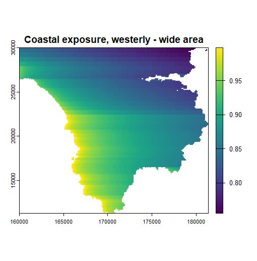

`landsea` and all rasters supplied via `coarse` are automatically ordered from finest to coarsest resolution, regardless of the order in which they are are supplied. The calculation therefore uses the highest available resolution throughout the fetch, only switching to coarser rasters where finer-resolution data are no longer available.

Setting `jitter = TRUE` slightly randomises the sampling direction. This helps reduce striping artefacts caused by repeatedly sampling along exactly the same raster bearings, while rarely altering the overall spatial pattern.

```{r}
ce_jit <- coastalexposure(landsea, wdir = 270, jitter = TRUE)
plot(c(ce_w, ce_jit), main = c("Default", "jitter = TRUE"), mar = c(2, 2, 2, 5))
```

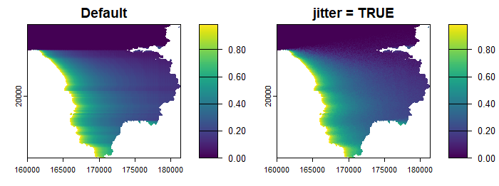

The weighting given to nearby versus distant coastline is controlled by `n`. The default (`n = 2`) uses inverse distance squared sampling and thus emphasises nearby coastline, while smaller values spread the weighting more evenly along the fetch. Whichever `n` is used, the search always reaches the edge of the available data. Lower values simply require more sample points to cover the same distance evenly, rather than in the rapidly widening steps used by larger values, so they increase computation time. When combined with very large `coarse` rasters, low values of `n` can therefore become computationally expensive. To prevent this, `coastalexposure()` automatically caps the search distance at twice the extent of `landsea` whenever `n < 2`, issuing a warning if the cap is applied. Increasing `n` or supplying a smaller `coarse` raster removes this limitation.

```{r}
ce_linear <- coastalexposure(landsea, wdir = 270, n = 1)
plot(ce_linear , main = "Coastal exposure, westerly - linear")
```
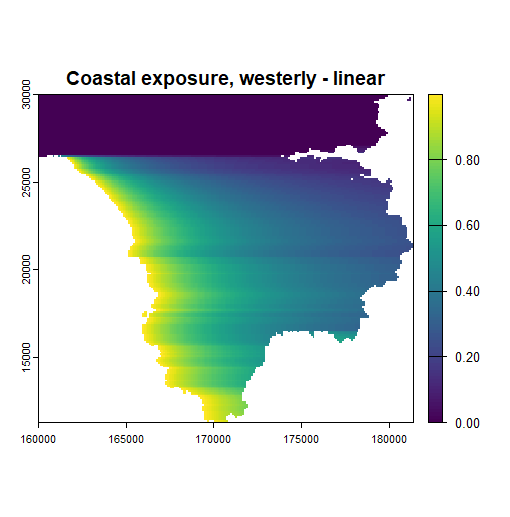

When a direction-independent measure of coastality is required, setting `wdir = "all"` averages the index across eight compass directions.

```{r}
ce_all <- coastalexposure(landsea, wdir = "all", jitter = TRUE)
plot(ce_all, main = "Coastal exposure, all directions")
```

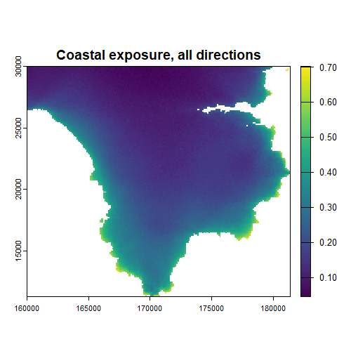

## Hydrology

Terrain also controls how water moves across the landscape. The shape of the land determines which areas drain into which, how much upslope area feeds into any given point, and, in turn, how wet that point tends to be. These properties are fundamental to hydrology, but are also widely used in ecology, for example to model soil moisture, cold-air drainage and pooling on still nights, and the distribution of moisture-loving vegetation. `terravars` provides a small hydrological toolkit for preparing a DTM for hydrological analysis, tracing how water flows across the surface, delineating drainage basins, and calculating topographic wetness.

### Preparing a DTM for hydrological analysis

Most hydrological analyses assume that every cell has a drainage path to an outlet. Real-world DTMs rarely satisfy this because noise, data artefacts and structures such as bridges crossing streams often create small spurious pits that trap simulated water. `fillsinks()` removes these artefacts by raising each pit just enough for a continuous downhill (or flat) path to reach an outlet, either the edge of the raster or an `NA` cell such as the sea. This is therefore normally the first step before carrying out any of the hydrological analyses below.

```{r}
dtm_filled <- fillsinks(dtm)
filled <- dtm_filled - dtm
```

Not every depression is an artefact, however. Lakes, ponds and reservoirs are genuine depressions, and filling them in the same way would raise their surface to the lowest spill point, destroying their true water level. Supplying a `waterbody` mask tells `fillsinks()` which depressions should instead be treated as real water. Each connected water body is flattened to its own minimum elevation (surface-return DTMs generally represent water surfaces well, making this a good estimate of water level) and is then treated as an outlet during sink filling, in the same way as the raster edge or an `NA` sea cell. Everywhere else in the DTM is filled as before.

The bundled `landcover` dataset makes this easy to demonstrate. Classes 13 and 14 represent Saltwater and Freshwater, so they can be supplied directly via `water_value`.

```{r}
lcov <- rast(landcover)
dtm_filled <- fillsinks(dtm, waterbody = lcov, water_value = c(13, 14))
filled2 <- dtm_filled - dtm
plot(c(filled, filled2), main = c("Filled", "Water filled"), mar = c(2, 2, 2, 5))
```
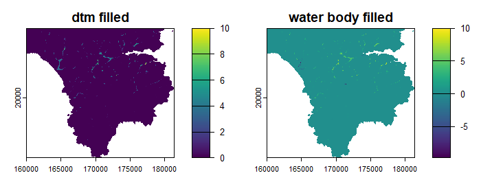


If `waterbody` is already a simple mask (for example `landsea` from the [Coastal exposure] section), `water_value` can be left at its default of `NA`, following this package's usual convention that `NA` represents water.

### Delineating and merging basins

Once the DTM has been hydrologically cleaned, `basindelin()` can be used to assign every cell to a drainage basin: the catchment draining to a single local low point. Each basin grows outward and upward from its lowest point until it meets neighbouring basins.

```{r}
bsn <- basindelin(dtm_filled)
plot(bsn, main = "Basins")
```
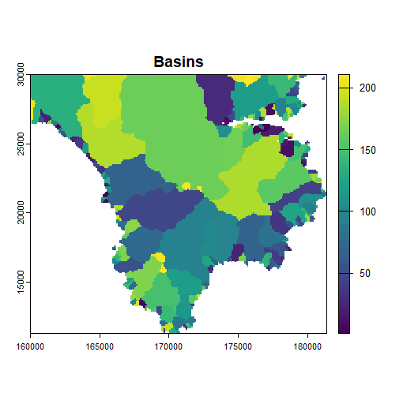

By default (`method = "steepest"`), water is assumed to flow only to the single steepest downhill neighbour, so each cell is assigned to the basin reached by that unique flow path. Setting `method = "any"` instead assumes that water can flow to any downhill neighbour. The two methods usually produce very similar results, differing only along some basin boundaries.

These basins are defined by topography alone and are therefore often extremely fine-grained, since even a very small ridge separates adjacent catchments. That behaviour is appropriate for modelling surface water, but can be too restrictive for other applications. Cold air, for example, readily spills across shallow topographic barriers that water cannot cross. `basinmerge()` merges neighbouring basins separated only by a shallow pour point, producing larger connected pooling units.

```{r}
bsn_merged <- basinmerge(dtm_filled, bsn, boundary = 0.25)
plot(bsn_merged, main = "Merged basins")
```

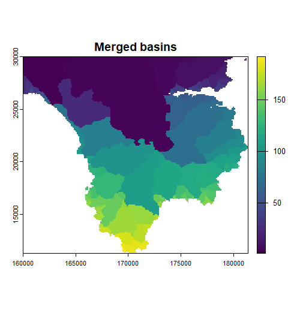

The `boundary` argument (0.25 m by default) controls how shallow the separating barrier must be. Two basins are merged when the elevation of their shared pour point lies within `boundary` metres of the floor elevation of the lower basin. Small values therefore merge only very weakly separated basins, while larger values progressively merge across higher barriers.

### Flow accumulation

`flowacc()` calculates the amount of upslope area draining through each cell. High values identify where water converges into streams and rivers, whereas low values occur on ridges and other areas contributing little or no runoff.

```{r}
acc <- flowacc(dtm_filled, method = "mfd")
plot(log1p(acc), col = rev(map.pal("viridis")), main = "Flow accumulation (log scale)")
```

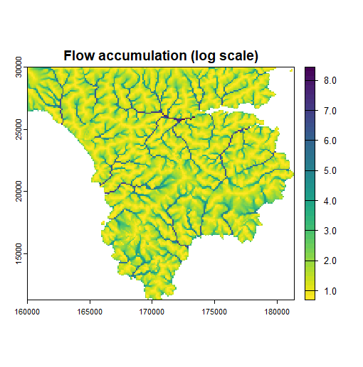

Flow accumulation usually spans several orders of magnitude, so plotting on a log scale often reveals drainage patterns much more clearly than raw values. Three routing methods are available via `method`: `"d8"` (the default), which routes all flow to the single steepest downhill neighbour; `"mfd"`, which partitions flow among all downhill neighbours in proportion to slope, producing smoother, more diffuse drainage patterns; and `"dinf"`, which routes flow between the two neighbouring cells spanning the steepest downslope direction, with the split determined by how closely each aligns with that direction. This reduces the grid-aligned artefacts of D8 while avoiding the greater lateral dispersion produced by MFD. A `weight` raster can also be supplied, allowing accumulation of quantities such as rainfall volume instead of assuming each cell contributes equally. Supplying a basin raster via `bsn` restricts flow to within each basin, preventing it from crossing basin boundaries even where local gradients would otherwise allow it.

### Topographic wetness index

`twi()` combines slope and flow accumulation into a terrain-based index of potential wetness. Locations receiving water from a large upslope contributing area while having a gentle local slope receive high values, whereas steep slopes and topographic highs receive low values. The index depends only on terrain and does not account for rainfall, soils or vegetation, but it provides a widely used first approximation of where water is likely to accumulate.

```{r}
w <- twi(dtm_filled)
plot(w, col = rev(map.pal("viridis")), main = "Topographic wetness index")
```

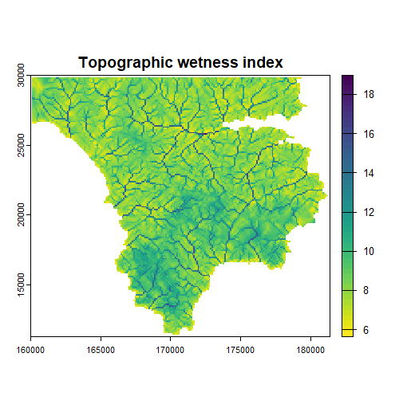

Three formulations are available via `method`: `"standard"`, the classical definition; `"modified"` (the default), which avoids infinite values on perfectly flat ground; and `"saga"`, which uses the formulation implemented in SAGA GIS, replacing the local slope term with an effective catchment slope to reduce unrealistically high wetness values in broad, gently sloping valleys. If a flow accumulation raster has already been computed, it can be supplied via `flow_acc` to avoid recalculation. The `route`, `weight` and `bsn` arguments are passed directly to the internal `flowacc()` call when `flow_acc` is not supplied. Setting `fillna = TRUE` prevents cells from acquiring missing values where slope and aspect cannot otherwise be calculated because part of the local neighbourhood extends over an `NA` region or beyond the edge of the DTM. This is particularly useful for coastal rasters, where land cells beside an `NA` sea cell would otherwise acquire missing values, but it also avoids the ring of missing values that would otherwise appear around the outer edge of the output.

## Data download

Every example so far has used the bundled Lizard Peninsula data. For a new area, `dem_download()` and `landcover_download()` fetch a digital terrain model and land-cover classification directly from public data sources, with no account, API key or additional packages required beyond `terravars` itself.

### Downloading land cover

`landcover_download()` fetches ESA WorldCover, a global 10 m resolution land-cover classification, and resamples it onto the grid of a template raster:

```{r}
lc <- landcover_download(dtm)
plot(lc, main = "Downloaded land cover")
```
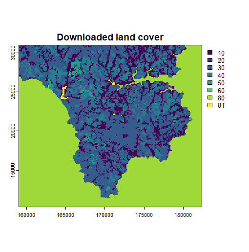

Because land cover is categorical rather than continuous, resampling uses the modal (most common) class within each output cell rather than interpolation. ESA WorldCover does not distinguish between the sea and inland water bodies, assigning both to class `80` ("Permanent water bodies"). By default (`watersplit = TRUE`), `landcover_download()` separates these after download: any connected water body that reaches the edge of the requested area is assumed to connect to the sea beyond it and remains class `80`, whereas enclosed water bodies are reclassified as `81` (freshwater). Setting `watersplit = FALSE` retains ESA WorldCover's original classification, with all water assigned to class `80`:

```{r}
lc_raw <- landcover_download(dtm, watersplit = FALSE)
plot(c(lc, lc_raw), main = c("watersplit = TRUE", "watersplit = FALSE"), mar = c(2, 2, 2, 5))
```
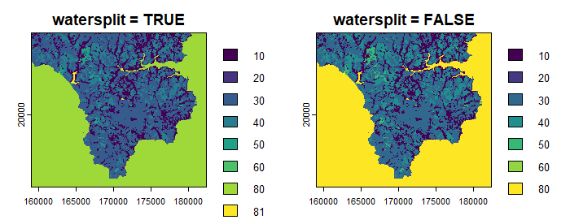

With `watersplit = TRUE`, sea (`80`) and freshwater (`81`) are shown as separate classes. With `watersplit = FALSE`, all water bodies retain the original class `80`.

### Downloading a DTM

`dem_download()` fetches elevation data from the AWS Terrain Tiles dataset. A template `SpatRaster` defines the extent, resolution and coordinate reference system of the returned raster.

```{r}
dtm_new <- dem_download(dtm)
plot(dtm_new, main = "Downloaded DTM")
```
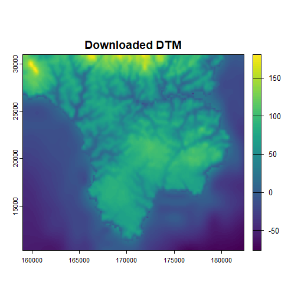

The Terrain Tiles dataset combines terrestrial elevation with bathymetry, the latter generally being available at a coarser resolution. This can produce unrealistic elevations along coastlines. Rather than fetching a land/sea mask internally, `dem_download()` accepts any raster on the same grid via the `mask` argument. Cells whose values match `mask_value` are masked in the returned DTM, with `mask_out` controlling whether they are returned as `NA` (the default) or `0` (sea level).

The land-cover raster downloaded above is a natural choice. Using `mask_value = 80` masks only the sea, leaving inland lakes and rivers untouched:

```{r}
dtm_clean <- dem_download(dtm, mask = lc, mask_value = 80)
plot(dtm_clean, main = "Downloaded DTM, sea masked out")
```
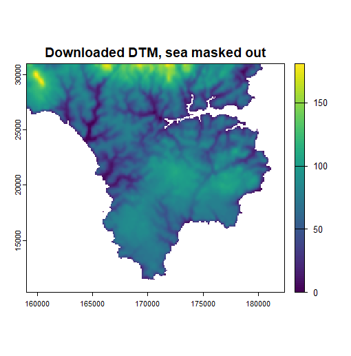
Passing `mask_value = c(80, 81)` instead masks all water. Because the AWS Terrain Tiles dataset blends terrestrial elevation with coarser bathymetry, coastal land cells are often assigned elevations below sea level. Whenever a mask is supplied, `dem_download()` automatically clamps these coastal cells to 0. As an additional safeguard, setting `belowsea = FALSE` clamps all cells in the downloaded DTM so that no elevation falls below zero.